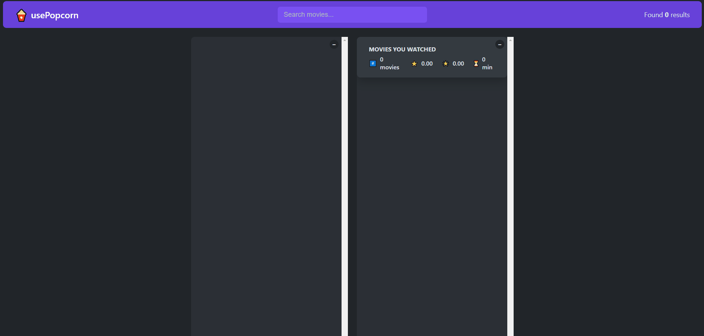

# usePopcorn

## Overview

usePopcorn is a React-based application that provides users with a way to explore and rate movies, users can also manage their watched movies list. By leveraging the OMDB API, the app gains access to an extensive movie database, allowing users to quickly and easily find movie information, including genre, cast, director, ratings, and much more. Designed to provide an interactive and user-friendly platform for movie enthusiasts to discover

## Main Features

- search movie
- show movie details
- rate movie and add to watched
- remove movie from watched
- show stats about your watched movies
- use `Enter` or `Esc` key to start or close searching movie
- watched movies stored in browser local storage

## Practice case

- Using the `useEffect` Hook to perform asynchronous operations.

- Using the `localStorage` to save the state of the application.

- Using the `useRef` hook to manipulate DOM in various intances.

- Creating Custom Hooks in React.

- Managing state of a component.

### Demo

Here's a glimpse of the final project:

